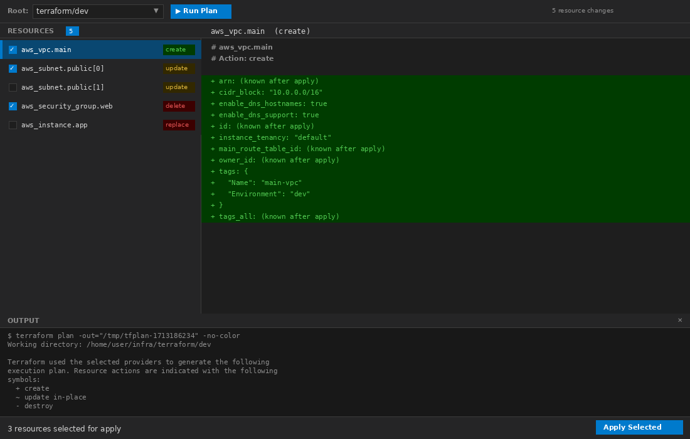

# Terraform UI — VSCode Extension

A visual diff tool for Terraform plan changes with targeted apply support.



## Features

- **Visual Plan Diff**: Run `terraform plan` and see all resource changes in a split-pane UI
- **Resource List**: Left panel shows all resources to be changed with action badges (create/update/delete/replace)
- **Diff Viewer**: Click any resource to see its attribute-level diff on the right panel
- **Targeted Apply**: Select specific resources with checkboxes and apply only those changes using `-target`
- **Live Terminal Output**: See real-time `terraform` command output in the bottom panel
- **CLI Confirmation**: Type "yes" to confirm apply, just like the standard Terraform CLI
- **Auto-Detection**: Automatically finds all Terraform roots in your workspace

## Usage

1. Open a workspace containing Terraform files (`.tf`)
2. Open the Command Palette (`Ctrl+Shift+P` / `Cmd+Shift+P`)
3. Type **"Terraform UI"** and select it
4. Or right-click a folder/`.tf` file in the Explorer and select **"Terraform UI"**

### Workflow

1. Select a Terraform root from the dropdown
2. Click **▶ Run Plan** to execute `terraform plan`
3. Review resources in the left panel — click any to see detailed diff
4. Check the resources you want to apply
5. Click **Apply Selected** at the bottom
6. Type `yes` in the confirmation prompt and press Enter

## Requirements

- **Terraform CLI** must be installed and available in your `PATH`
- Terraform must be initialized (`terraform init`) in your project directories

## Development

```bash
cd experiments/vscode-terraform-ui
npm install
npm run compile
```

To test: Press `F5` in VSCode to launch Extension Development Host.

## Release

### Prerequisites

- `vsce` CLI (installed as devDependency via `@vscode/vsce`)
- VS Code Marketplace PAT ([Azure DevOps](https://dev.azure.com/signageos/_usersSettings/tokens) → Marketplace: Manage scope)
- Open VSX token ([open-vsx.org](https://open-vsx.org) → User Settings → Access Tokens)

### Manual Release

1. Update `CHANGELOG.md` — rename `[Unreleased]` to `[X.Y.Z]`, add fresh `[Unreleased]` above
2. Bump version:
   ```bash
   npm version X.Y.Z --no-git-tag-version
   ```
3. Build and package:
   ```bash
   npm run vscode:prepublish
   npm run vscode:package
   ```
4. Publish to both marketplaces (tokens from encrypted `.env`):
   ```bash
   npm run vscode:publish
   ```
   Or individually:
   ```bash
   npm run vsce:publish
   npm run ovsx:publish
   ```
5. Commit, tag, and push:
   ```bash
   git add package.json package-lock.json CHANGELOG.md
   git commit -m "Bump X.Y.Z"
   git tag -a "vX.Y.Z" -m "Release vX.Y.Z"
   git push origin master && git push origin "vX.Y.Z"
   ```

### GitLab CI Release

The `.gitlab-ci.yml` pipeline automates publishing:

1. **Every push**: `build` job compiles and packages the `.vsix`
2. **Manual on default branch**: `release:tag` creates a git tag from the current `package.json` version
3. **On tag push**: `publish:vsce` and `publish:ovsx` publish to both marketplaces
4. **On tag push**: `release:notes` creates a GitLab release

**Required CI/CD variables:**
| Variable | Description |
|----------|-------------|
| `CI_REPOSITORY_PUSH_USERNAME` | GitLab username with push rights (for tagging) |
| `CI_REPOSITORY_PUSH_TOKEN` | GitLab token with push rights (for tagging) |

**Tokens in encrypted `.env`** (decrypted via SOPS at publish time):
| Variable | Description |
|----------|-------------|
| `VSCE_PAT` | VS Code Marketplace Personal Access Token |
| `OVSX_TOKEN` | Open VSX Registry access token |
